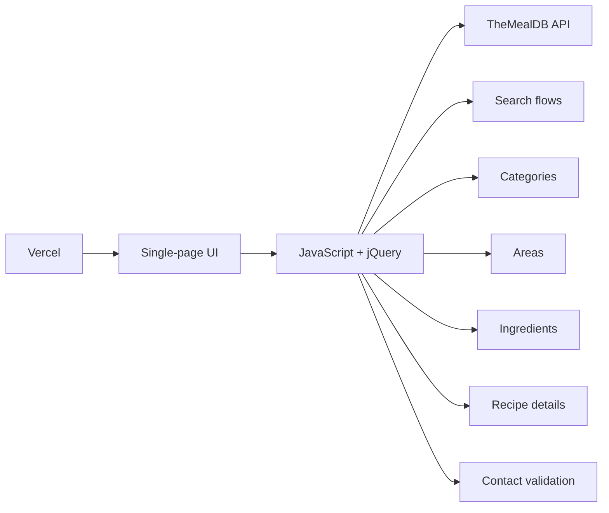

# Yummy — Recipe Explorer

**Live demo:** https://yummy-blush-nine.vercel.app

Yummy is a responsive recipe-discovery web app built with HTML, CSS, Bootstrap, JavaScript, and jQuery. It integrates TheMealDB API to let users browse meals, search by name or first letter, explore categories, areas, and ingredients, and open detailed recipe instructions.

## Core features

- Browse meals from TheMealDB
- Search recipes by name or first letter
- Explore meals by category
- Explore meals by geographic area
- Browse common ingredients
- View recipe instructions, measurements, tags, source links, and YouTube links
- Client-side contact-form validation
- Responsive Bootstrap layout
- Animated navigation and loading states

## Portfolio boundaries

This is a front-end portfolio project:

- Recipe data comes from TheMealDB; there is no custom backend.
- The contact form demonstrates client-side validation only and does not submit to a server.
- There are no user accounts, saved recipes, or community-sharing features.
- Navigation and rendering are handled client-side with JavaScript and jQuery.

## Architecture at a glance



## Recruiter quick scan

- Vanilla JavaScript API integration using async/await and fetch
- jQuery-driven navigation and transitions
- Multiple discovery flows from one API
- Dynamic DOM rendering from remote data
- Responsive Bootstrap UI
- Client-side validation with user feedback
- Live Vercel deployment

## Tech stack

- HTML5
- CSS3
- Bootstrap
- JavaScript
- jQuery
- Font Awesome
- TheMealDB API

## Project structure

```text
Yummy/
├── css/        # Bootstrap, Font Awesome, and custom styles
├── images/     # Local assets
├── js/
│   ├── index.js
│   ├── jquery-3.6.1.min.js
│   └── bootstrap.bundle.min.js
├── webfonts/
├── index.html
└── README.md
```

## Run locally

```bash
git clone https://github.com/SamirNexus/Yummy.git
cd Yummy
```

Open `index.html` directly, or use a local static server:

```bash
npx serve .
```

## Portfolio highlights

- Integrated multiple TheMealDB endpoints into a single interactive recipe explorer
- Implemented search, category, area, ingredient, and detail flows
- Rendered remote API data dynamically into reusable UI patterns
- Added animated navigation, loading feedback, and responsive layouts
- Built client-side contact-form validation without backend dependencies
- Deployed the project with Vercel

## Author

**Mohamed Samir** — Front-End Developer  
[GitHub](https://github.com/SamirNexus) · [LinkedIn](https://www.linkedin.com/in/samirnexus98/)
